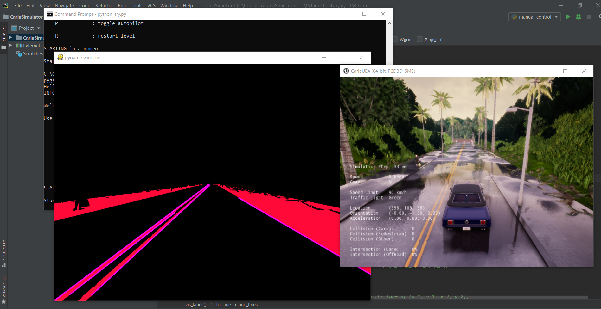

# lane-detection-using-sementic-segmentation-from-Carla-Simulator

Here I try to estimate the lane in which the car belongs using the on-board semantic segmentation camera from the Carla Simulator . i begin by applying a mask to filter the output of semantic segmentation , I apply then morphological transformation which reduce the canny edge computation then finish by applying a Hough transformation to detect lines . 

line filter is not optimal , I’ll try to update it soon .

